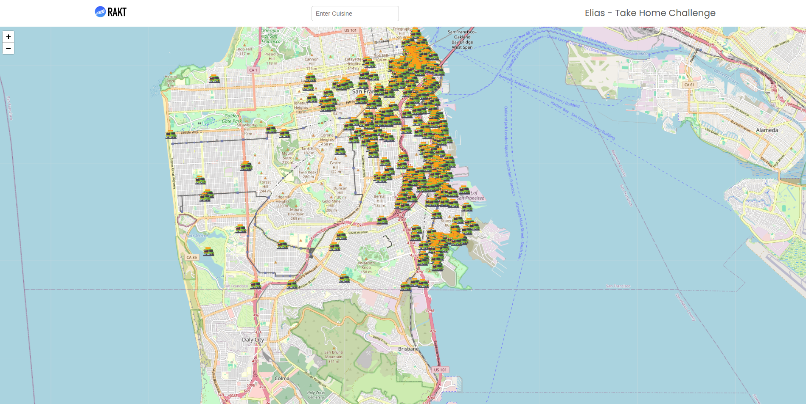
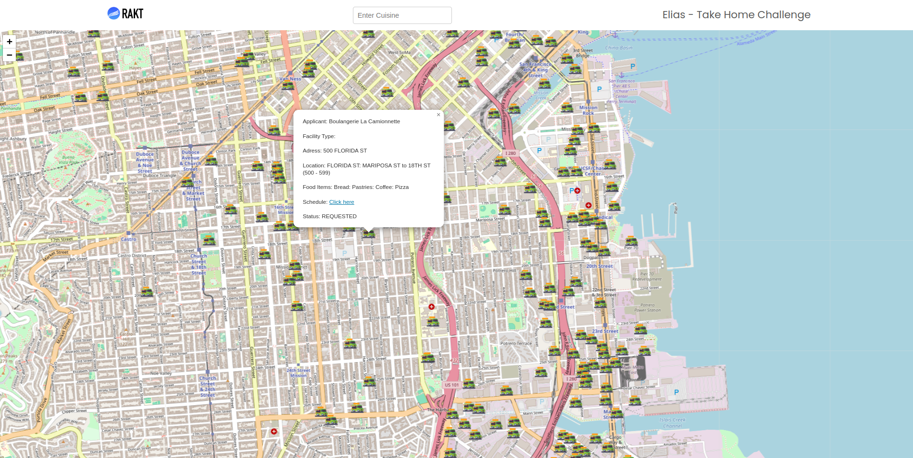

## Food Truck App (Django, Reactjs and Docker)

### How to run the application.

### Backend

Step 1:

* Clone the application to your local machine
* In the root of the application go to the `/backend` folder.

Step 2:

* Create a `.env` file within the `/backend` folder and add the following content:

``` .env
POSTGRES_DB=rackt_project_db
POSTGRES_USER=rackt_project_user
POSTGRES_PASSWORD=rackt_project_password
SECRET_KEY=mysecretkey123
```
<br>
Step 3:

Add the following command to make the application run:

`docker-compose up --build`

Step 4:
Go to the following path to access the backend:
<br>
[http://localhost:8000/api/food-trucks/](http://localhost:8000/api/food-trucks/)

Different query params you can use:

To return different objects based on cuisine:
<br>
[http://localhost:8000/api/food-trucks/?cuisine=mexican](http://localhost:8000/api/food-trucks/?cuisine=mexican)

To return different objects based on latitude, longitude and radius:
<br>
[http://localhost:8000/api/food-trucks/?latitude=37.760086931986980&longitude=-122.418806481101140&radius=2](http://localhost:8000/api/food-trucks/?latitude=37.760086931986980&longitude=-122.418806481101140&radius=2)

<br>
Run backend CLI commands:

Populate FoodTruckInfo model from csv:
`python manage.py populate_food_trucks food-truck-data.csv`

Delete all data from a specific model:
`python manage.py delete_all_data <model_name>`

Retrieve nearby trucks (information):
`python manage.py retrieve_nearby_trucks <latitude> <longitude> <radius>`

Ex:
```
root@c99745dd6dd3:/app# python manage.py retrieve_nearby_trucks 37.760086931986980 -122.418806481101140 0.3
Nearby Food Trucks:
Name: Leo's Hot Dogs | Distance: 0.0 miles
Name: Natan's Catering | Distance: 0.22737891713614777 miles
Name: Julie's Hot Dogs | Distance: 0.2132391777781961 miles
Name: SOHOMEI, LLC | Distance: 0.17579350137205169 miles
Name: Julie's Hot Dogs | Distance: 0.06013131646801611 miles
Name: Julie's Hot Dogs | Distance: 0.08895032693756173 miles
```

<br>
Run tests:
`python manage.py test`

Ex:

```
..........
----------------------------------------------------------------------
Ran 10 tests in 1.880s

OK
Destroying test database for alias 'default'...
```

### Frontend
<br>
Run the application:

Step 1:

* In the root of the application go to the `/backend` folder.
* `npm install`
* `docker-compose up --build`
* Go to `localhost:3000`

<br>
If in windows:

* `npm install`
* `npm start`
* Go to `localhost:3000`

What sould appear:




### Rationale

What I would do if I had more time:
- Add more inputs with different queries in the frontend.
- Display each truck in different cards and its info with a button to check its location.
- In the frontend I would create separation of concerns with a directory with their own responsabilities.
- Would improve the frontend dockerization. 
